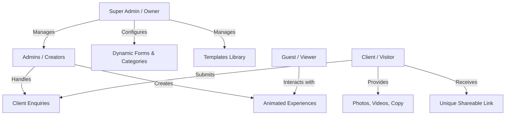

# Animated Digital Experience Platform - System Planning & Architecture

A complete platform for designing, managing, and delivering premium animated digital experiences for weddings, birthdays, proposals, surprises, anniversaries, companies, and every special moment.

---

## 🏛️ Complete System Architecture

The platform is divided into four major components:

1. **Public Marketing Website**: The official customer-facing website explaining the platform, showcasing templates, and collecting inquiries.
2. **Super Admin Panel**: The central administration console for platform owners to manage categories, dynamic forms, templates, admins, and global settings.
3. **Admin / Creator Panel**: The workspace for experience creators to pick templates, input client details, upload media, and publish final experiences.
4. **Public Experience Viewer**: The rendering engine that displays the final animated, interactive digital experience to the guests via a unique link.

---

## 👥 Role & Permissions Structure



### 1. Super Admin / Owner
The platform owner holds absolute access.
* **Template Management**: Create, upload/add, edit, preview, publish, unpublish, archive, and delete templates.
* **Category Management**: Add, edit, delete, and enable/disable categories (e.g., Wedding, Birthday, Proposal, Surprise, Anniversary, Corporate).
* **Form Builder / Management**: Dynamically configure the data fields required for each category so that no code changes are needed when adding new experience types.
* **Admin Management**: Create, disable, or delete admins, assign them specific category permissions, and monitor their active experiences.
* **System Management**: Manage website content, view platform-wide analytics, review all enquiries, and configure system settings.

### 2. Admin / Experience Creator
Handles the fulfillment of client orders.
* **Workflow**:
  1. Receive a new client enquiry.
  2. Identify the category (e.g., Wedding).
  3. Browse and select a template.
  4. Fill in the category-specific dynamic form.
  5. Upload client media (photos, videos, background music).
  6. Preview the generated experience.
  7. Send a preview link to the client for feedback.
  8. Perform requested revisions.
  9. Publish the final experience and share the unique link.

### 3. Client (End User)
The purchaser of the experience.
* **Workflow**:
  1. Browse templates on the marketing website.
  2. Fill out the inquiry form.
  3. Upload assets/details or provide them to the Admin.
  4. View the preview link and request revisions.
  5. Receive the final shareable URL.

### 4. Experience Viewer (Guest / End-Recipient)
The final audience who interacts with the invitation or experience.
* **Capabilities**: Interact with animations, view event details/galleries, play music/videos, RSVP, navigate to venues via map links, and send wishes/congratulations.

---

## 🌍 Part 1 — Public Marketing Website

The main entry point (`yourdomain.com`).

### 🏠 Homepage Layout
* **Hero Section**:
  * Heading: *"Turn Your Special Moments Into Interactive Digital Experiences."* or *"Create Memories. Experience Them Differently."*
  * Call-To-Action (CTA): `Explore Experiences` | `View Templates` | `Create Your Experience` | `Contact Us`.
  * Visual: A high-fidelity, interactive, premium animated demo showcasing invitations and events morphing dynamically.
* **Platform Introduction**: Explaining interactive invitations vs. static paper/PDF designs.
* **Categories Showcase**: Visual cards for each event type (Wedding, Birthday, Proposal, etc.).
* **Template Gallery**: Filterable grid displaying template thumbnails, names, styles, and a **Preview** button.
* **Benefits Section**: Highlight key value propositions:
  * No PDF - purely interactive and animated.
  * Premium micro-animations & transitions.
  * Dynamic elements (RSVP tracker, Map directions, Wishbooks).
  * Fast, mobile-first design.
  * Zero app installations required.
* **How It Works**:
  1. Choose your experience category.
  2. Select your desired template design.
  3. Share your text details, photos, and music.
  4. We design and compile your premium experience.
  5. Get your unique link and share it instantly on WhatsApp/Socials.

---

## 🧭 Dynamic Category-Based Form Builder

Rather than hardcoding fields, the form fields are dynamically rendered based on the Category schema defined by the Super Admin.

### Default Standard Category Schemas

#### 💍 Wedding
* **Bride & Groom Details**: Names, parent details, bio/quotes.
* **Event Details**: Wedding Date, Time, Venue Names, Complete Addresses.
* **Interactive Elements**: Google Maps location pins, Countdown timer, RSVP form.
* **Media**: Photo gallery, love story timeline, background music (audio file), YouTube video link.

#### 🎂 Birthday
* **Person Details**: Name, Age, Birth Date.
* **Event Details**: Party Date, Time, Venue Address, Map coordinates.
* **Media**: Main showcase photo, memory gallery, background music, special birthday messages.

#### 💝 Proposal
* **Partner Details**: Host Name, Partner Name.
* **Proposal Story**: How they met, relationship story.
* **Media**: Couple photo gallery, background music.
* **Interaction**: Interactive "Will you marry me?" button that triggers a custom animation on a "Yes" click.

#### 💑 Anniversary
* **Couple Details**: Names, Anniversary milestone (e.g., 25th).
* **Details**: Celebration Date, Time, Venue, Maps location.
* **Media**: Couple photos across the years, memory timeline, background music.

#### 🏢 Corporate / Company
* **Company Details**: Company Name, Logo, Brand colors.
* **Event Details**: Event Type, Date, Time, Registration form.
* **Media**: Team photos, promotional videos, event schedule/itinerary.

---

## ⚙️ Core Technical Engines

### 1. Dynamic Form Engine
```text
Super Admin adds Custom Field -> Category Schema updated in Database -> Enquiry Form on Website and Admin Form in Panel adapt automatically.
```
* **Supported Field Types**: `text`, `textarea`, `number`, `date`, `time`, `single-image`, `multi-image`, `audio`, `video-link`, `color-picker`, `coordinate-location`.

### 2. Template Mapping & Rendering Engine
The Admin links a generated Experience to a specific Template.
```text
Client Content (DB JSON) + Chosen Template (CSS/JS files) = Unique Animated Page
```
Each template defines a JSON contract of required visual keys. When rendered, the viewer dynamically feeds the client's database values into the template layout.

---

## 🛠️ Site & Route Structure

### 🌐 Public Frontend
* `/` — Homepage
* `/categories` — Category Explorer
* `/templates` — Template Directory
* `/templates/:category/:templateId` — Live Template Demo Page
* `/enquiry` — Dynamic Request Form
* `/e/:experienceSlug` — **The Live Interactive Client Experience** (e.g., `/e/rahul-priya-wedding`)

### 🧑💻 Creator Admin Panel
* `/admin/login` — Authentication
* `/admin/dashboard` — Overview & assigned enquiries
* `/admin/enquiries` — Manage leads and assign templates
* `/admin/experiences` — Create, edit, and preview active projects
* `/admin/media` — Cloud asset library

### 👑 Super Admin Panel
* `/superadmin/dashboard` — Global analytics and activity logs
* `/superadmin/admins` — Add/modify creator credentials and permissions
* `/superadmin/categories` — Define categories and build forms
* `/superadmin/templates` — Register and upload new codebase templates

---

## 🧭 Complete Development Roadmap

### Phase 1 — Planning & Identity
* Finalize the Brand Name & Design System (Aesthetic style guides, typography, and core colors).
* Establish the base schemas for Users, Categories, Templates, Enquiries, and Experiences.

### Phase 2 — Core Backend Engine
* Set up a REST/GraphQL API with secure role-based authorization (Super Admin vs. Admin).
* Develop CRUD interfaces for Categories, Templates, and Enquiries.

### Phase 3 — Marketing Website
* Build the responsive homepage, template listing page, and interactive template previews.
* Implement the dynamic enquiry form rendering system.

### Phase 4 — Dynamic Form & Field Builder
* Build the Admin interface to create form fields dynamically for different categories.
* Store the form configurations in the database and ensure the client forms render dynamically.

### Phase 5 — Super Admin & Admin Dashboards
* Construct the control panels for both user roles.
* Set up the Enquiry management pipeline (Status transitions: `New` ➔ `In Progress` ➔ `Preview Sent` ➔ `Published`).

### Phase 6 — Interactive Template Development
* Build the first flagship **Wedding Template**:
  * Animated pre-loader and cover opening.
  * Parallax scrolling background with soft particle effects.
  * Couple introductions, photo gallery, event scheduler, Google Map embed, RSVP handler, and sound toggle.

### Phase 7 — Custom Experience Generation & Publishing
* Implement code that compiles the client details with the chosen template.
* Establish slug-based routing for generating public URLs (e.g. `/e/john-jane-wedding`).
* Deploy the application structure to support high-performance rendering.
